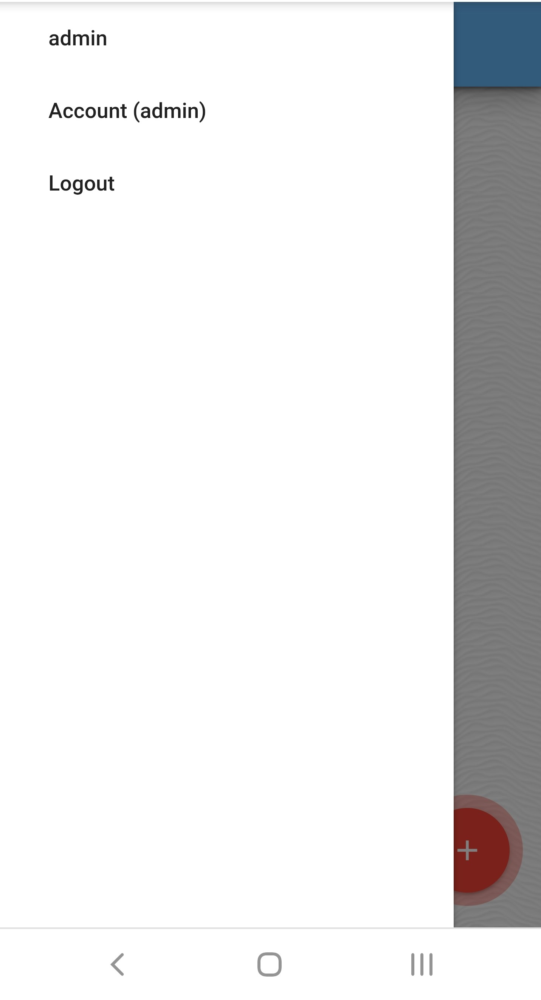

# Memo-IT-App
Memo IT is a web application that allows you to store your memos in cloud, wherever you are.
In order to store data in cloud, you need a Memo account.
Application is fully responsive, so it adapts to device, no matter if it's desktop or smartphone.
Each note is related to user account, so there is no way to lookup another user's notes.
While using phone, navigation bar is hidden, to use it's features you can open it within navigation button..
# Homepage
In homepage you can see all your memos sorted by published/edited date.
There are three types of notes: Text note, List note, Picture Note.
You can change color of each note to suit your needs.
In bottom right corner there is button to add a new note.
From this view you can delete or edit any note.
# Create / Edit Note
Each note stores information about: Title, Content, Time Published
For Text Note and Note List you can set one of desired themes (colors).
While editing note all of information is received from database and fetched info form.
In note list you can edit only desired elements.
Editing note page adapts note color for previously selected theme.
# Account page
On account page there is information of all notes in table form, for easier management.
You can delete all your notes on single click.
In footer there is information about your account.
You can delete your account along with all your notes permanently.

# Screenshots

